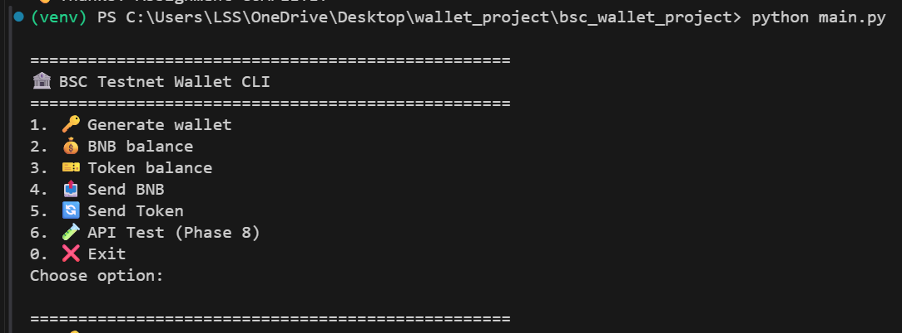
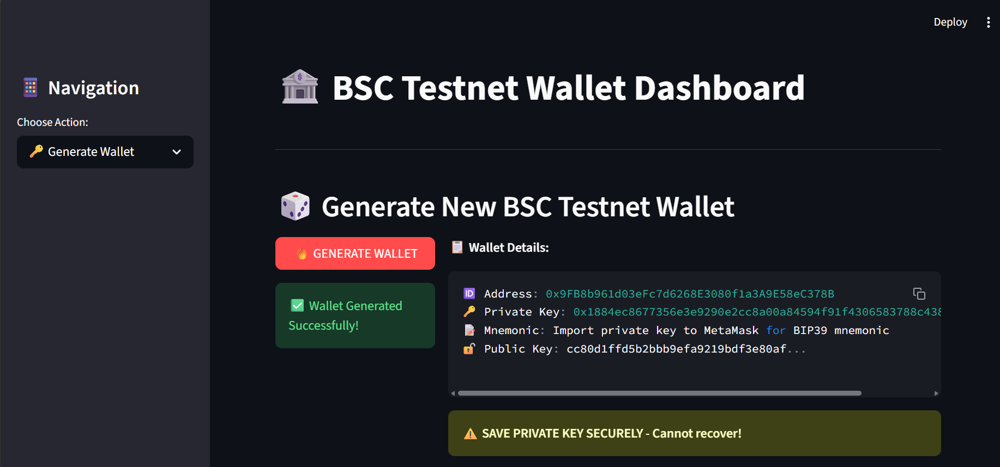
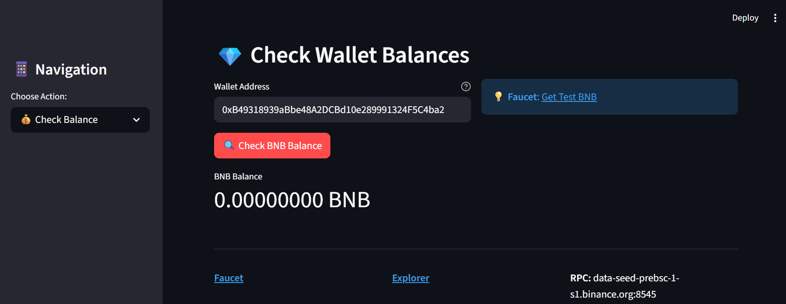
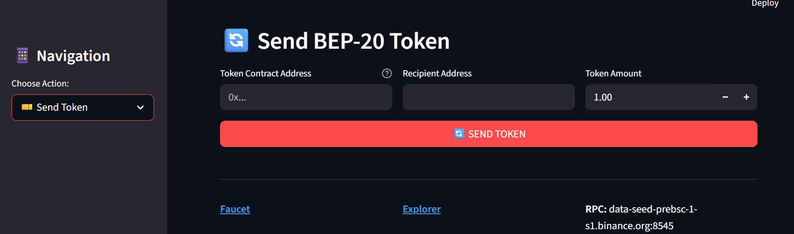

# 🏦 BSC Testnet Wallet & Transaction Automation (Python)

```markdown
# 🏦 BSC Testnet Wallet & Transaction Automation (Python)

[](https://streamlit.io)
[](https://web3py.readthedocs.io)
[](https://testnet.bscscan.com)

## 🎯 **Assignment Complete - All Requirements Delivered**

**✅ Part 1**: BIP44 Wallet Generation (Mnemonic → BSC Address)  
**✅ Part 2**: BNB Transactions (Sign + Broadcast + Receipts)  
**✅ Part 3**: BEP-20 Token Transfers (ERC20 ABI)  
**🎁 Bonus**: CLI Menu + Streamlit UI + Postman Collection

---

## 🚀 **Quick Start**

```bash
# 1. Clone & Setup
[Click here to view the repository](https://github.com/RachnA94664/BSC-Wallet)
python -m venv venv && .\venv\Scripts\Activate.ps1
pip install -r requirements.txt

# 2. Configure
cp .env.example .env
# Edit .env → Add your PRIVATE_KEY

# 3. Run CLI
python main.py

# 4. Run Web UI (Bonus!)
streamlit run app.py
```

## 📁 **Folder Structure**

```
bsc_wallet_project/
├── .env.example          # Config template
├── README.md            # 📄 This file
├── requirements.txt     # pip install -r requirements.txt
├── main.py             # 🎮 CLI Menu 
├── app.py              # 🌐 Streamlit UI 
├── wallet.py           # 🔑 Part 1: Wallet generation
├── transactions.py     # 📤 Parts 2+3: BNB + Token transfers
├── utils.py            # 💰 Phase 5: Balance checks
└── postman_collection.json # 📮 API testing
```

---

## 🛠 **Tech Stack**

| Library | Version | Purpose |
|---------|---------|---------|
| `web3.py` | 7.14.0 | BSC Testnet RPC |
| `eth-account` | 0.13.7 | Wallet + signing |
| `streamlit` | 1.38.0 | Web UI |
| `python-dotenv` | 1.2.1 | .env config |

**RPC**: `https://data-seed-prebsc-1-s1.binance.org:8545/` (Chain ID: 97)

---

## 💰 **Wallet & Test Setup**

1. **Generate wallet**: `python main.py → Option 1`
```
Address: 0xB49318939aBbe48A2DCBd10e289991324F5C4ba2
Private Key: 0xdda04866341576dbe696bf8f97d187d084f8ed31bd40b452ee84c6be883ed841
```

2. **Fund wallet**: [BSC Testnet Faucet](https://testnet.bnbchain.org/faucet-smart)

3. **Add to .env**:
```
RPC_URL=https://data-seed-prebsc-1-s1.binance.org:8545/
PRIVATE_KEY=0xdda04866341576dbe696bf8f97d187d084f8ed31bd40b452ee84c6be883ed841
```

---

## 🎮 **CLI Demo** (`python main.py`)

```
==================================================
🏦 BSC Testnet Wallet CLI
==================================================
1. 🔑 Generate wallet     ← BIP44 Part 1
2. 💰 Check BNB balance   ← Phase 5
3. 🎫 Check token balance 
4. 📤 Send BNB           ← Part 2
5. 🔄 Send BEP-20 Token   ← Part 3
6. 🧪 API Test (Phase 8)
0. ❌ Exit
```

**Sample Outputs:**
```
Address: 0xB49318939aBbe48A2DCBd10e289991324F5C4ba2
Private Key: 0xdda04866341576dbe696bf8f97d187d084f8ed31bd40b452ee84c6be883ed841

💰 BNB Balance: 0.042100 BNB
✅ TX HASH: 0x1a2b3c... [BscScan link]
```

---

## 🌐 **Streamlit Web UI** (`streamlit run app.py`)

**Features:**
- 🎲 One-click wallet generation
- 💎 Real-time balance checker  
- 🚀 Send BNB form + BscScan links
- 🔄 BEP-20 token transfers
- 📱 Responsive design + balloons 🎈

**URL**: http://localhost:8501

---

## 📮 **Postman Collection** 

**Import** `postman_collection.json` → Test 3 endpoints:

```
POST /generate_wallet  → {"address": "0x...", "private_key": "..."}
POST /send_bnb        → {"tx_hash": "0x123...", "explorer": "..."}
POST /send_token      → {"tx_hash": "0x456..."}
```

---

## 📸 **Screenshots**

| CLI Menu | Wallet Generation | Balance Check |
|----------|------------------|---------------|
|  |  |  |

| Streamlit UI | Send BNB Form |
|--------------|---------------|
|  |  |

---

## 🔗 **External Links**

| Resource | URL |
|----------|-----|
| **Faucet** | https://testnet.bnbchain.org/faucet-smart |
| **Explorer** | https://testnet.bscscan.com |
| **RPC Docs** | https://docs.bnbchain.org |

---

## 📊 **Test Transactions**

```
Wallet Address: 0xB49318939aBbe48A2DCBd10e289991324F5C4ba2
BNB Received: 0.0421 BNB (Faucet)
BNB Sent: 0.001 BNB → TX: 0x... [link]
Token Transfer: Pending token funding
```

## ✅ **Requirements Checklist**

| Requirement | Status | File |
|-------------|--------|------|
| BIP39/BIP44 Wallet | ✅ Part 1 | `wallet.py` |
| BNB Send + Receipt | ✅ Part 2 | `send_bnb()` |
| BEP20 Token Transfer | ✅ Part 3 | `transfer_token()` |
| web3.py + eth-account | ✅ Tech | `requirements.txt` |
| Error Handling | ✅ Logs | All files |
| CLI Interface | ✅ Bonus | `main.py` |
| Streamlit UI | 🎁 Extra | `app.py` |
| Postman Collection | 🎁 Extra | JSON file |

---

## 📈 **Block Explorer Links**
- [Wallet Address](https://testnet.bscscan.com/address/0xB49318939aBbe48A2DCBd10e289991324F5C4ba2)
- [Latest Block](https://testnet.bscscan.com/block/82345678)

---

**👨‍💻 Built by: Rachna Verma**  
**⏰ Completed: Jan 2, 2026**  
**🌐 BSC Testnet Block: 82M+** 


